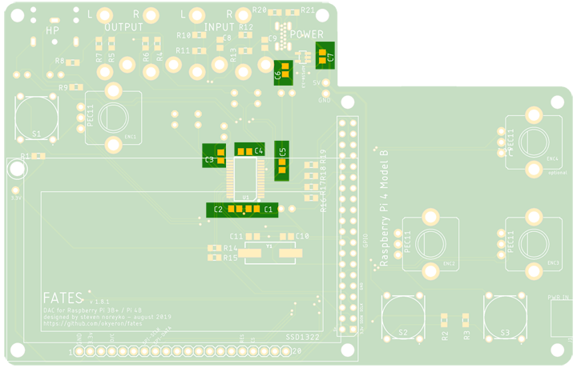

## Fates 1.8+ Build

This is an intermediate to advanced build. If you've not soldered a TSSOP chip before (the DAC), this build may be challenging. Seek assistance if possible.

Everything is marked on the pcb, but if you need help, please see below for parts placement  

### DAC

Solder the DAC first. Use flux. Google some videos if you're not sure how best to solder it.

### Voltage regulator

Do the little voltage regulator next and then check your work on all those tiny pins with a loupe/magnifier.

### 100n capacitors  

### 220p capacitors  

### 18p capacitors  

### 100R resistors  

### 220R resistors  

### 2.2K resistors  

### 5.1K resistors  

### 5.6K resistors  

### 10K resistors  

### 47K resistors  

## USB-C Jack 

The pins here are quite small and close together. Use flux!

Be aware of the routing on the USB Jack pins. Some pins are tied together, so don't be alarmed if your soldering looks bridged on the diagonals.  

## TIP - Test voltage

Once the USB-C jack is attached, check USB-C power input voltage levels. I suggest doing this __before__ you attach the pi. There's a 5v/GND header pin holes right near the voltage regulator which is great for testing voltage (+5v).

## Thru-hole capacitors

These all attach from the bottom. Values are marked on the board. 

## Display header pins

NOTE - Don't solder the display directly to the Fates pcb. Use the low profile header listed in the BOM. You won't want to desolder 20 pins to remove it if something goes wrong with the display.

I use the following method for the display pins - insert the long end of the header pins from the top of the display and then solder them in place from the bottom. Then clip the short header pins from the top.

This ends up with about 6mm between the main board and the display carrier board. You could trim the pins if you want the display to sit lower. My case designs include a 6mm standoff for this mounting technique.

## Switches (buttons)

Pin 1 is marked on the bottom of the switches. Pin 1 on the pcb is the lower right corner - there's a very small dot there.

## Audio jacks

Audio jacks mount __from the bottom__

NOTE - if you use the CUI MJ-3536 jacks from Mouser, you may need to trim or file the pins to fit in the pcb. The CUI jack pins are just a tiny bit wider than the PJ302M jacks.

